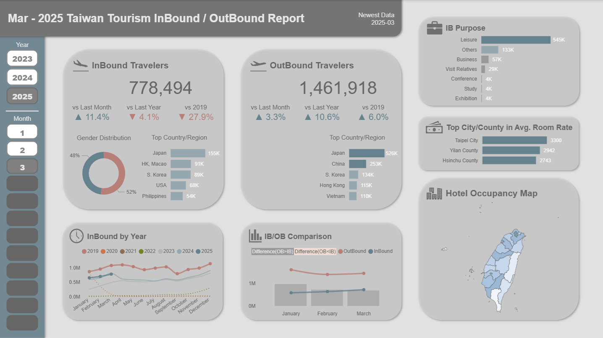
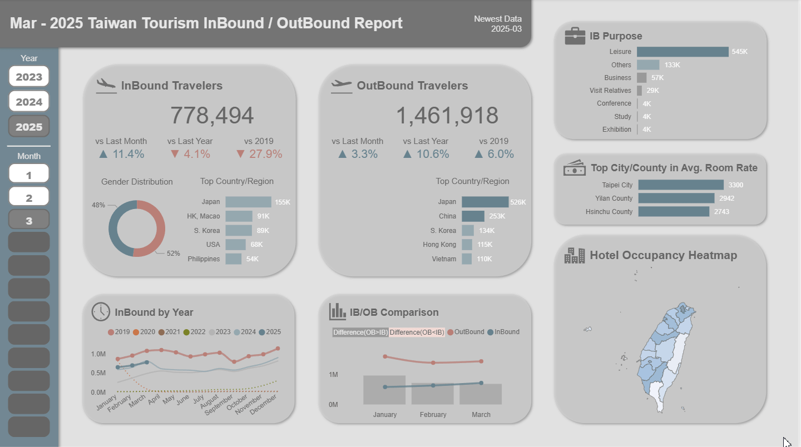

[中文版本](README_zh.md) | [English](README.md)  
  
# Taiwan Tourism Inbound&Outbound Report   
  
## Project Overview  
This Power BI dashboard analyzes inbound and outbound visitor trends in Taiwan from 2019 to 2025, featuring dynamic year and month selection buttons. It offers visual insights into monthly seasonality, country/region distributions, visitor purposes, and hotel occupancy rates by city and county. The dashboard also compares current figures to pre-COVID levels and highlights the significant gap between inbound and outbound travel volumes.  

## Data Source  
- Source:  
  - Tourism Statistics Database of The Tourism Administration, M.O.T.C.  
    1. [Hotel Operation Report by City and County](https://admin.taiwan.net.tw/businessinfo/FilePage?a=9711)  
    2. [Visitor Arrivals by Gender and by Purpose of Visit](https://stat.taiwan.net.tw/statistics/month/inbound/gender/purpose)  
    3. [Outbound Departures of Nationals of the Republic of China by Destination](https://stat.taiwan.net.tw/statistics/month/outbound/destination)  
- Coverage:  
  - 2019–2025, monthly breakdown  
- Notes:  
  - A manually created country/region table is used to match inbound and outbound data for Power BI relationships. Note that some country/region names are not fully aligned between the two datasets. For example, Hong Kong and Macao are combined in the Inbound data but listed separately in the Outbound data.  
  - Alias tables for visitor purposes and city/county names are created in Power BI for translation.
  - A Date table is created in Power BI.  
  - Data cleaning and transformation are handled in Power BI using Power Query.  

## Dashboard Features  
  
- Dynamic year and month buttons.  
- Inbound and outbound volumes compared to previous month, same month last year, and pre-COVID(2019).  
- Selectable top inbound and outbound countries/regions for the selected month.  
- Breakdown of inbound travelers' visiting purposes.  
- Year over year monthly inbound trends, highlighting pre- and post-COVID shifts.  
- Line and column chart displaying monthly inbound-outbound gap.  
- Choropleth map showing average hotel occupancy rates by city/county.
- Automatic data cleaning and transformation with Power Query.  

## Demo Video  
  
  
## Project Structure  
Taiwan Tourism Inbound&Outbound Report/  
├── data/  
│   └── Hotels by CountyCity/  
│   └── Inbound/  
│   └── Outbound/  
├── demo_video/  
│   └── Demo_Taiwan Tourism Inbound&Outbound Report.gif  
├── pbip/  
│   └── Taiwan Tourism Inbound&Outbound Report.pbip  
├── preview_images/  
│   └── Preview_Taiwan_Tourism_Inbound&Outbound_Report_01.png  
│   └── Preview_Taiwan_Tourism_Inbound&Outbound_Report_02.png  
│   └── Preview_Taiwan_Tourism_Inbound&Outbound_Report_03.png  
├── .gitignore  
└── README.md  
  
## Limitations  
A  

## License  
A  
  
